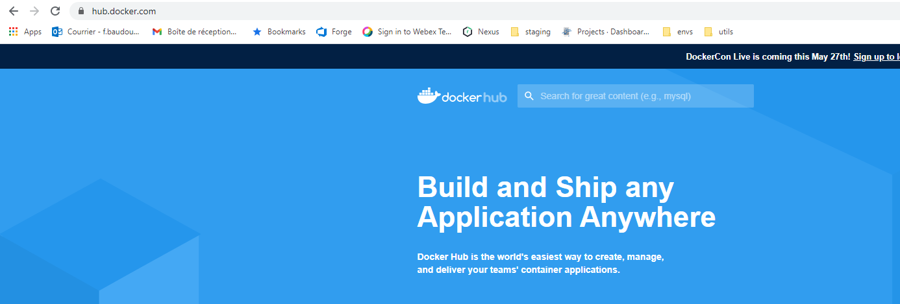
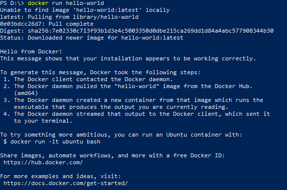
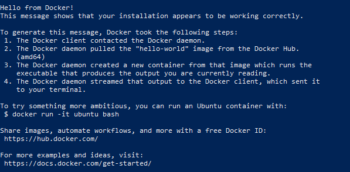
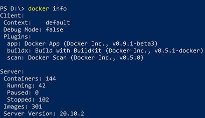
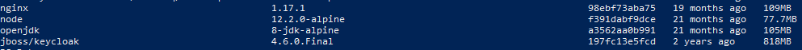
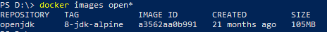
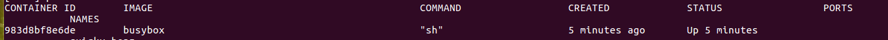
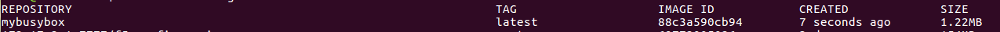
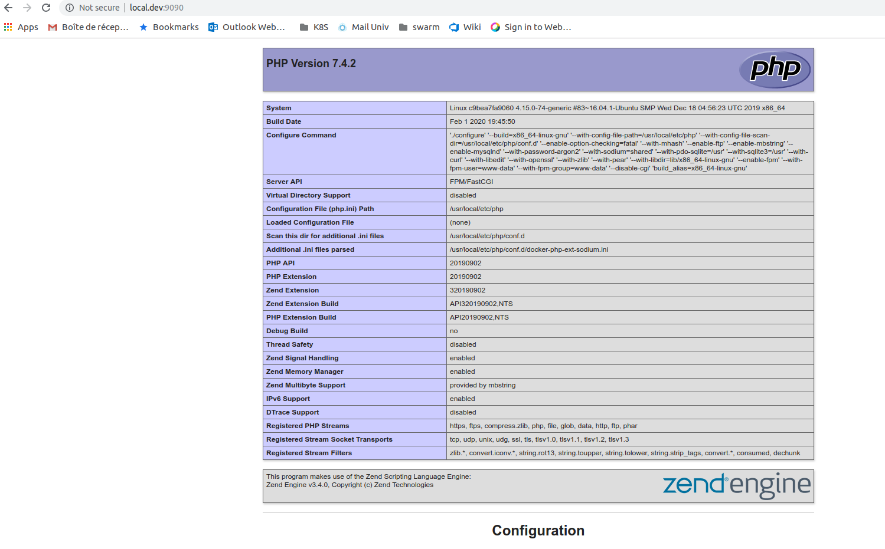
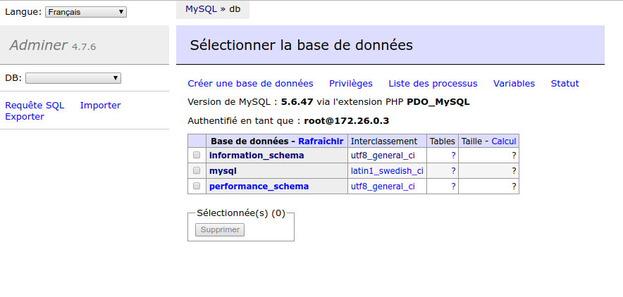

Docker nous permet d'exécuter des applications sur une machine sans avoir besoin de les installer.


# Les bases

Commençons, comme tout bon informaticien, par lancer le hello-world.
Avec Docker cela revient à écrire quelque chose comme:

```docker run hello-world```

Cette commande demande au programme docker ( qui doit donc être installé sur la machine ) de démarrer un conteneur basé sur l'image hello-world

Pour lancer ce conteneur, docker a donc besoin d'une image, ici "hello-world".  
Si il ne la trouve pas, il va la télécharger dans un repository.
Le repository par défaut est le docker hub. 



Le docker hub dispose d'un site web qui permet de rechercher toutes les images mises à disposition.  
https://hub.docker.com/

Mais revenons à l'exécution de notre Hello world.  
On voit sur les 5 premières lignes, le téléchargement de l'image depuis le repository.  


Si je lance une seconde fois, la même commande, que se passe t il ?




L'image n'est pas téléchargée à nouveau, cela signifie que Docker possède une liste d'images en local.

Nous pouvons savoir combien d'images différentes notre docker local a dans son cache :    
```docker info``` 



On comprend en regardant ces infos que les images et les conteneurs sont 2 notions différentes pour Docker, et que ces notions n'ont pas le même cycle de vie puisque les conteneurs semblent pouvoir avoir plusieurs états ( running,paused,stopped )

Nous allons donc réaliser quelques manipulations pour bien comprendre ces notions. 

## Les images 

Si l'on veut voir la liste de toutes les images dans le cache de notre Docker nous avons la commande:  
```docker images```



Dans l'exemple ci dessus, on voit qu'il a 4 images.
Donc nous pouvons lancer chacune de ces applications depuis notre machine sans avoir à les installer.
Une image est un modèle d'application et la commande ```docker run``` démarre une instance d'application à partir d'un modèle. Ces instances sont appelées des conteneurs.

Pour faire l'analogie avec la programmation orientée objet, on pourrait voir ça comme :
* l'image docker est une classe
* le conteneur docker est une instance de cette classe


### Commandes utiles à la gestion des images

Pour obtenir la liste des images, on a déja vu ```docker images``` . La commande peut prendre en troisième argument un filtre sur le nom des images à rechercher.  
Par exemple :  


Si on analyse le contenu des différentes informations qui nous sont données

* REPOSITORY  : le nom de l'image Docker, éventuellement préfixée par le nom du repository d'ou elle provient. Dans le cas du Docker hub , il n'y a pas de prefix
* TAG : généralement la version de l'image, ou pourra également trouvé le mot clé LATEST qui signifie que c'est la dernière version de l'image mise à disposition sur le repository
* IMAGE ID : Un sha 256 pour cette image.
* CREATED : La date de création de l'image dans son repository. Ce n'est pas la date à laquelle l'image a été téléchargée sur votre Docker.
* SIZE : La taille de l'image dans le cache Docker local


## Les conteneurs

Je peux également voir les conteneurs qui sont en cours d'exécution sur ma machine en utilisant :

```docker ps```

__Manip1__ : Ou l'on comprend qu'une image est une définition statique

* docker run -ti busybox 
* ls 
* rm -rf bin 
* ls 

-> Notre conteneur est inutilisable

* exit 
* docker run -ti busybox 
* ls


__Manip2__ : Ou l'on comprend qu'un conteneur arrêté n'est pas supprimé

* docker ps -a  | grep busy

On retrouve nos conteneurs busybox et on voit qu'ils sont arrêtés
Mais on peut toujours accéder aux logs en faisant

* docker logs "Id du conteneur"

On comprend bien l'interet pour faire des analyses après l'arrêt d'un conteneur, mais il nous faut toutefois un moyen de faire le ménage.

* docker rm "Id du conteneur" va nous permettre de supprimer définitivement le conteneur

On peut également décider au moment du lancement que le conteneur devra être supprimé dès qu'il s'arrête

* docker run -rm -ti busybox 
* touch youpi.txt
* exit

On ne retrouve pas de trace de ce conteneur via docker ps.

__Manip3__ : Ou l'on comprend que l'on peut créer une nouvelle image à partir d'un conteneur en cours d'execution

* docker run -ti busybox
* touch hello.txt

dans un autre terminal:

* docker ps


* docker diff "container id"
-> on voit les différences entre le conteneur et l'image sur laquelle il est basé

* docker commit "container id" mybusybox
* docker images 


* docker run -ti mybusybox
* ls

On a toujours notre fichier hello.txt

Donc on peut se retrouver avec des dizaines d'images issues d'une même image originelle.
On va avoir besoin d'un moyen de faire le ménage.

* docker rmi "Id de l'image"

__Manip4__ : Ou l'on découvre comment qu'un repository n'est pas obligatoire
* docker save --output mybusybox.tar mybusybox
* docker rmi mybusybox
* docker images | grep busy
* docker load --input mybusybox.tar
* docker images | grep busy


Nous aurons peut être besoin de cette façon de procéder si le rsx de l'IUT ne nous aide pas pour la suite de ce td :-) 

Passons à quelque chose de plus utile, nous allons démarrer un serveur Web sous docker.
Nous utiliserons le serveur Web NGINX.
Rendons nous sur le site du docker hub et trouvons le nom de l'image d'un serveur NGINX.

* docker run nginx 
Pour ne pas bloquer notre terminal, on va même faire un docker run -d nginx. Cela aura pour effet de lancer le conteneur en tache de fond ( -d pour daemon ) et de nous rendre la main.
On pourra vérifier que le container nginx est bien en cours d'execution via la commande __docker ps__


On peut d'ailleurs voir en sortie de cette commande que nginx utilise le port 80 ( normal pour un serveur Web )

Donc si je lance mon navigateur sur http://localhost:80 ou http://127.0.0.1:80, je devrais avoir la page d'accueil de NGINX ?  Non , pourquoi cela ?

__Manip5__: mapper les ports

Les conteneurs sont isolés de la machine hote. Si l'on veut pouvoir accèder à un conteneur depuis une machine, il faut déclarer un mapping entre un port de la machine hote et un port du conteneur.

* docker run -p 80:80 nginx

Cette fois http://localhost:80 doit nous répondre par la page d'accueil de NGINX.

Est ce que je pourrais lancer 2 fois le conteneur NGINX sur ma machine ?

__Manip6__: mapper les volumes

Pratique ce serveur Web sans installation, mais il ne diffuse que la page par défaut.
Je voudrais lui faire diffuser ma propre page.

ok , on peut se connecter au conteneur, trouver ou se situent les pages et modifier la page

* docker exec -ti "id conteneur" bash

Par defaut, NGINX va diffuser les fichiers qui se situent ici : /usr/share/nginx/html
Il y a un fichier index.html, on peut l'éditer. .... non, il n'y a pas d'éditeur disponible sur le conteneur
On peut remplacer le fichier index.html par le notre

* docker cp "fichier local"   "id conteneur":"chemin fichier sur le conteneur"

Franchement, pour le développement ce n'est pas pratique, je ne vais pas faire une copie à chaque fois que je vais modifier mes pages html. On doit pouvoir faire mieux.

De la même manière que l'on peut mapper un port de la machine hote avec un port du conteneur, on peut mapper un répertoire de la machine hote avec un repertoire du conteneur.

* docker run --rm -d -p 80:80 -v "/home/fred/test/html":"/usr/share/nginx/html" nginx

Cette fois cela fonctionne de façon assez pratique !
 
Manip7: Compose

Par contre la ligne de commande commence à devenir un peu complexe.
Si l'on veut un environnement avec un serveur Web + PHP + Base de données, on va devoir faire des scripts...
En plus si une page PHP située dans un conteneur veut accèder à la base de donnée qui est dans un autre conteneur comment va t on les connecter ? 

Docker a un outil prévu pour cela, il s'agit de docker-compose.
Cet outil fonctionne avec un fichier de description docker-compose.yml
Créons donc un fichier de ce type :

```
version: '3'
services:
  web:
   image: nginx:latest
   ports:
   - "9090:80"

   volumes:
   - ./code:/code
   - ./site.conf:/etc/nginx/conf.d/site.conf
```

C'est quoi ce site.conf ?
C'est un fichier de configuration pour NGINX, on va arrêter d'utiliser le fichier de conf par défaut car on va établir une liaison vers un conteneur PHP.
Mais pour le moment, gardons le très simple

```
server {
    index index.html;
    server_name local.dev;
    error_log  /var/log/nginx/error.log;
    access_log /var/log/nginx/access.log;
    root /code;
}
```
On peut déja vérifier que NGINX se lance bien.

* docker-compose up

Il faut modifier le fichier /etc/hosts de la machine hote pour que "local.dev" soit résolu par 127.0.0.1
Ensuite lancer un navigateur sur http://local.dev:9090


Maintenant, on peut relier NGINX à PHP.
D'abord, on va démarrer un conteneur qui gère le PHP et on va lui donner accès à notre code source :

```
version: '3'
services:
  web:
   image: nginx:latest
   ports:
   - "9090:80"

   volumes:
   - ./code:/code
   - ./site.conf:/etc/nginx/conf.d/site.conf
 

  php:
   image: php:7-fpm
   volumes:
   - ./code:/code
```

Ensuite on peut configurer NGINX pour utiliser le conteneur php.
Comment je fais pour savoir quel est le port d'écoute du conteneur php ?

Cela se fait dans le fichier site.conf

```
server {
    index index.php index.html;
    server_name local.dev;
    error_log  /var/log/nginx/error.log;
    access_log /var/log/nginx/access.log;
    root /code;

    location ~ \.php$ {
        try_files $uri =404;
        fastcgi_split_path_info ^(.+\.php)(/.+)$;
        fastcgi_pass php:9000;
        fastcgi_index index.php;
        include fastcgi_params;
        fastcgi_param SCRIPT_FILENAME $document_root$fastcgi_script_name;
        fastcgi_param PATH_INFO $fastcgi_path_info;
    }
}
```

La ligne la plus importante est "fastcgi_pass php:9000;"  car elle signifie que NGINX va déléguer le traitement des scripts php à une machine nommée php sur le port 9000.

Les conteneurs peuvent se parler par leur nom et sans mapping des ports ???? 
C'est la magie de docker-compose.

Vous pouvez ajouter un fichier index.php dans le répertoire code et relance votre docker-compose up,  NGINX doit pouvoir le servir désormais.



Pour que notre env de développement soit complet, il ne nous manque plus que la base de donnée.

```
version: '3'
services:
  web:
   image: nginx:latest
   ports:
   - "9090:80"

   volumes:
   - ./code:/code
   - ./site.conf:/etc/nginx/conf.d/site.conf
 

  php:
   image: php:7-fpm
   volumes:
   - ./code:/code

  db:
   image: mysql:5.6
   environment:
    MYSQL_ROOT_PASSWORD: example
```

Vous noterez au passage l'utilisation de la directive __environment__ dans le fichier docker-compose.
Cela permet de passez des valeurs à des variables d'environnement connues à l'intérieur du conteneur. Pratique pour la configuration !!

Comme je ne sais pas coder en php , je ne sais pas comment faire une page php qui se connecte à la base de données.
Mais vous pouvez la faire !

Moi, je vais utiliser un dernier conteneur qui va me permettre de faire cette vérification 

```
version: '3'
services:
  web:
   image: nginx:latest
   ports:
   - "9090:80"

   volumes:
   - ./code:/code
   - ./site.conf:/etc/nginx/conf.d/site.conf
 

  php:
   image: php:7-fpm
   volumes:
   - ./code:/code

  db:
    image: mysql:5.6
    environment:
      MYSQL_ROOT_PASSWORD: example

  adminer:
    image: adminer
    ports:
      - 9091:8080

```

Maintenant que vous savez lire un fichier docker-compose, vous trouverez l'URL qui vous permettra d'accèder à la page de connexion à la base de données.



Vous serez également en mesure d'analyser les fichiers qui vous ont été fournis pour vos projets précédents et d'enfin les comprendre :-)  


 
