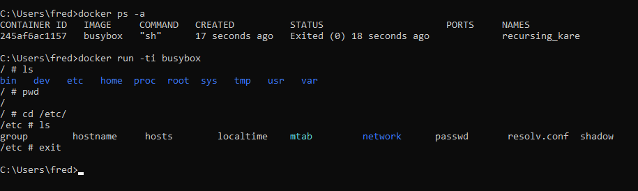

Docker nous permet de démarrer des conteneurs qui exécutent des applications sur une machine sans avoir besoin de les installer.


# Les bases

Commençons, comme tout bon informaticien, par lancer le hello-world.
Avec Docker cela revient à écrire quelque chose comme:

```docker run hello-world```

Cette commande demande au programme docker ( qui doit donc être installé sur la machine ) de démarrer un conteneur basé sur l'image hello-world

Pour lancer ce conteneur, docker a donc besoin d'une image, ici "hello-world".  
Si il ne la trouve pas, il va la télécharger dans un repository.
Le repository par défaut est le docker hub. 


Le docker hub dispose d'un site web qui permet de rechercher toutes les images mises à disposition.  
https://hub.docker.com/

Mais revenons à l'exécution de notre Hello world.  
On voit sur les 5 premières lignes, le téléchargement de l'image depuis le repository.  


Si je lance une seconde fois, la même commande, que se passe t il ?


L'image n'est pas téléchargée à nouveau, cela signifie que Docker possède une liste d'images en local.

Nous pouvons savoir combien d'images différentes notre docker local a dans son cache :    
```docker info``` 


On comprend en regardant ces infos que les images et les conteneurs sont 2 notions différentes pour Docker, et que ces notions n'ont pas le même cycle de vie puisque les conteneurs semblent pouvoir avoir plusieurs états ( running,paused,stopped )

Nous allons donc réaliser quelques manipulations pour bien comprendre ces notions. 

## Les images 

Si l'on veut voir la liste de toutes les images dans le cache de notre Docker nous avons la commande:  
```docker images```


Dans l'exemple ci dessus, on voit qu'il a 4 images.
Donc nous pouvons lancer chacune de ces applications depuis notre machine sans avoir à les installer.
Une image est un modèle d'application et la commande ```docker run``` démarre une instance d'application à partir d'un modèle. Ces instances sont appelées des conteneurs.

Pour faire l'analogie avec la programmation orientée objet, on pourrait voir ça comme :
* l'image docker est une classe
* le conteneur docker est une instance de cette classe


### Commandes utiles à la gestion des images

#### Lister les images 
Pour obtenir la liste des images, on a déja vu ```docker images``` . La commande peut prendre en troisième argument un filtre sur le nom des images à rechercher.  
Par exemple :  


Si on analyse le contenu des différentes informations qui nous sont données

* REPOSITORY  : le nom de l'image Docker, éventuellement préfixée par le nom du repository d'ou elle provient. Dans le cas du Docker hub , il n'y a pas de prefix
* TAG : généralement la version de l'image, ou pourra également trouvé le mot clé LATEST qui signifie que c'est la dernière version de l'image mise à disposition sur le repository
* IMAGE ID : Un sha 256 pour cette image.
* CREATED : La date de création de l'image dans son repository. Ce n'est pas la date à laquelle l'image a été téléchargée sur votre Docker.
* SIZE : La taille de l'image dans le cache Docker local

Pourquoi, il y a un IMAGE ID alors qu'on a déjà un REPOSITORY et un TAG ?  
Les images peuvent être construites localement ( on verra cela par la suite ), et si l'on construit plusieurs fois la même image, on peut se retrouver avec des situations comme la suivante :  


Avant de construire une image satisfaisante du logiciel(celle qui a le tag develop-snapshot), j'ai construit 4 images du même logiciel qui ont des sha256 différent.


#### Supprimer les images 

La syntaxe pour la suppression d'une image :

```docker rmi IMAGE ID```

D'ailleurs l'image de Hello World ne m'est plus utile, je veux la supprimer  

```docker images Hello*```   , pour récuperer l' ID  


```docker rmi XXXXXXXXX``` pour la suppression    


Non seulement, Docker ne veut pas me supprimer l'image mais en plus il me dit que cette image est utilisée par conteneur qui est stoppé !!  
Nous allons avoir besoin de creuser un peu plus cette notion de conteneur avant de pouvoir supprimer cette image.

## Les conteneurs


### Lister les conteneurs
Je peux lister les images docker, je dois pouvoir lister les conteneurs qui sont issus de ces images.
La commande qui permet de lister les conteneurs en cours d'exécution est :

```docker ps```


* CONTAINER ID : Un sha 256 pour ce conteneur
* IMAGE        : Le nom de l'image , plus le tag de l'image , séparés un _:_
* COMMAND      : Le nom de la commande qui est exécuté par le conteur à son démarrage ( le nom de l'application en fait )
* CREATED      : La date de création du conteneur sur votre machine
* STATUS       : le cycle de vie ( en cours d'exécution )
* PORT         : le/les ports exposés par le conteneur 
* NAMES        : le nom du conteneur


Pourquoi je n'ai rien dans la liste ? Pourtant j'ai lancé un conteneur Hello World !

En réalité, le conteneur a démarré, il a lancé la commande lui permettant d'exécuter l'application et ... 
l'application s'est terminée. 
L'application Hello World affiche juste un texte puis se termine donc le conteneur avait terminé son travail, il s'est stoppé.

Pourquoi je ne peux pas supprimer l'image Hello World si il n'y a plus de conteneur actif pour cette image ?

C'est parce que le conteneur existe toujours, d'ailleurs on peut le voir en exécutant la commande :  

```docker ps -a```


A quoi ça sert de garder un conteneur stoppé ?

En premier lieu, cela sert pour l'analyse des logs.
Un conteneur arrêté peut l'être à cause d'un crash de l'application et il faut être en mesure d'analyser ce qui a causé le crash.

La commande ```docker logs ID_CONTENEUR``` nous permet d'accéder aux logs d'un conteneur


Si l'analyse de logs ne suffit pas , on peut même redémarrer un conteneur stoppé grâce à :  
```docker start ID_CONTENEUR```

Il est à noter que contrairement à ```docker run``` , ```docker start``` démarre un conteneur en mode daemon et on ne voit donc pas le résultat sur la sortie standard

Pour voir le résultat sur la sortie standard, il faudra utiliser ```docker start -ai``` comme dans l'exemple ci-dessous.   


### Supprimer les conteneurs

On comprend bien l'intérêt de garder le conteneur pour faire des analyses après l'arrêt, mais il nous faut toutefois un moyen de faire le ménage.

```docker rm ID_CONTENEUR``` va nous permettre de supprimer définitivement le conteneur

On peut également décider au moment du lancement que le conteneur devra être supprimé dès qu'il s'arrête, en utilisant l'option --rm 

```docker run --rm hello-world```

On ne retrouve pas de trace de ce conteneur lorsque son exécution est terminée.
Comme dans l'exemple ci-dessous.  


Je peux maintenant supprimer l'image Hello world


### Manipuler les conteneurs

#### Lancer un conteneur en mode terminal interactif

Nous allons utiliser une image appelée busybox.
Si on fait un ```docker run busybox```, on verra la même chose qu'avec le Hello World, un conteneur qui s'exécute puis se termine. 
Mais en exécutant ensuite un ```docker ps -a```, on peut voir que la commande exectué par busybox est un shell ```sh```


Donc ce conteneur lance un , nous pouvons interagir avec ce shell en utilisant la commande :
```docker run -ti nom_de_l_image```  

  

On se retrouve dans un shell qui est en cours d'exécution par notre conteneur busybox
On peut donc lancer des commandes shell depuis ce terminal et on s'aperçoit que notre conteneur dispose de son propre système de fichiers !


Tant que nous sommes connectés à ce terminal, le conteneur reste en execution.
Si j'ouvre une autre fenêtre de commande et que je demande ```docker ps``` , je vais voir l'execution de mon conteneur.


Si je quitte le shell via la commande ```exit```, le conteneur busybox va s'arrêter 

je quitte 


le conteneur n'est plus en exécution


#### Un conteneur fait partie du bétail (Pet vs Cattle)

Nous venons de voir que l'on pouvait prendre la main dans un shell et que le conteneur avait son propre système de fichier. Donc on peut faire des bêtises dans ce système de fichier.
Par exemple : 

```docker run -ti busybox```
```rm -rf bin ```
```ls``` 


-> J'ai rendu notre conteneur complétement inutilisable, je n'ai plus qu'a quitter

Le fait d'avoir un dégradé un conteneur, ne m'empêche absolument d'en relancer un parfaitement opérationnel 
 
```docker run -ti busybox``` 
```ls```


Les images sont importantes, les conteneurs, eux , sont sacrifiables

D'accord mais si j'avais des données présentes dans le système de fichier de mon conteneur ? je ne vais pas les perdre si mon conteneur crashe?
Pas si l'on utilise correctement les volumes docker.

#### Lancer un conteneur en mappant un volume

La syntaxe permettant de donner accès à un répertoire de votre machine depuis l'intérieur d'un conteneur se fait au lancement du conteneur.  
La syntaxe est :

```docker run -v "repertoire local":"repertoire dans le conteneur" nom_de_l_image```

Dans le cas de notre busybox, cela donne quelque chose comme :

```docker run -ti  -v "C:\Users\fred\busyboxdata":"/data" busybox```

Si je lance mon conteneur avec cette ligne de commande, je constate qu'il y a un répertoire data accessible dans le conteneur.
Je peux créer un fichier dans ce répertoire et quitter le conteneur.


Le fichier, lui, persiste sur ma machine

 
Si je relance un conteneur, je vais retrouver mon fichier


#### Lancer un conteneur de la vraie vie

Jusqu'à présent, nous avons utilisés des conteneurs qui se terminaient d'eux même et qui ne faisaient pas grand chose. Il est temps de passer à des à quelque chose de plus utile, nous allons démarrer un serveur Web sous docker.
Nous utiliserons le serveur Web Apache httpd.
Rendons nous sur le site du docker hub et trouvons le nom de l'image


```docker run httpd``` 


Première constatation, mon terminal de commande est bloqué. Je dois en ouvrir un autre pour trouver le port exposé par mon conteneur


Il est donc indiqué que le conteneur utilise le port 80

Mais comment je peux accèder à ce port 80 ? Je ne connais pas l'adresse IP du conteneur. 
Si je tente d'accéder à http://localhost:80 , je suis en erreur


#### Mapper les ports
En réalité, les conteneurs sont isolés de la machine hôte. Si l'on veut pouvoir accéder à un conteneur depuis une machine, il faut déclarer un mapping entre un port de la machine hôte et un port du conteneur.

La syntaxe est :

```docker run -p "port local":"port dans le conteneur" nom_de_l_image```

Donc je dois stopper mon conteneur et en relancer un avec ce mapping de port.

Pour stopper mon conteneur, je peux utiliser la commande :
```docker stop ID_CONTENEUR```

Pour le stopper et le supprimer, je peux utiliser la commande :

```docker rm -f ID_CONTENEUR```


Lorsque je relance le conteneur, je vais ajouter quelques options à la ligne de commande.
L'option --rm  indique que si le conteneur est stoppé, je veux le supprimer
L'option -d indique que je veux lancer le conteneur en mode daemon, c'est à dire que je ne veux pas qu'il bloque mon terminal de commande.

Je relance donc avec :

```docker run -p 80:80  --rm -d httpd``` 


On peut voir que le port indique maintenant 0.0.0.0:80 -> 80/tcp  , la redirection de port est donc en place

Donc si je lance mon navigateur sur http://localhost:80 ou http://127.0.0.1:80, j'obtiens :


#### Mapper les volumes

Pratique ce serveur Web sans installation, mais il ne diffuse que la page par défaut.
Je voudrais lui faire diffuser ma propre page.

ok , on peut se connecter au conteneur, trouver ou se situent les pages et modifier la page
Comme il est lancé en mode daemon, pour obtenir un terminal interactif, je peux utiliser :
```docker exec -ti "id conteneur" bash```

Si le conteneur dispose d'un shell bash cela va fonctionner ( on peut aussi essayer avec sh )


Par défaut, http va diffuser les fichiers qui se situent ici : /usr/local/apache2/htdocs
Il y a un fichier index.html, on peut l'éditer. .... non, il n'y a pas d'éditeur disponible sur le conteneur
On peut créer un fichier en local et le copier dans le conteneur pour remplacer le fichier index.html

```docker cp "fichier local"   "id conteneur":"chemin fichier sur le conteneur"```

Franchement, pour le développement ce n'est pas pratique. Je ne vais pas faire une copie à chaque fois que je vais modifier mes pages html. On doit pouvoir faire mieux.

De la même manière que l'on peut mapper un port de la machine hôte avec un port du conteneur, on peut mapper un répertoire de la machine hôte avec un répertoire du conteneur.

```docker run -p 80:80 -v "C:\Users\fred\monsite":"/usr/local/apache2/htdocs"  --rm -d httpd```

Cette fois cela fonctionne de façon assez pratique !


## Faire communiquer les conteneurs entre eux

Pour communiquer de notre machine vers un conteneur Docker, on a vu que l'on devait mapper des ports et appeler notre conteneur via localhost ou 127.0.0.1.
Mais alors si on lance plusieurs conteneurs sur notre machine, comment vont ils communiquer ensemble ?

Pour que 2 conteneurs puissent communiquer ensemble, cela va se passer, comme souvent avec Docker, lors du lancement du conteneur

Premièrement, il faut lancer un conteneur en lui donnant un nom grâce à l'option --name 

Exemple :  

docker run --name serveurhttp  -d httpd


Ensuite, si l'on veut lancer un conteneur qui doit pouvoir communiquer avec notre conteneur appelé serveurhttp, il faudra le lancer avec l'option --link serveurhttp:nom_du_lien

Dans l'exemple ci-dessous, je lance un busybox qui peut dialoguer avec le serveur httpd via l'alias apache


De plus, même si mon conteneur httpd n'a pas le port 80 mappé sur localhost, mon conteneur busybox est quand même capable de l'appeler


Il y a donc un réseau interne au fonctionnement de docker qui propose du DNS.
L'étude du fonctionnement réseau de Docker sera par manque de temps hors du périmètre de ce td.
 
## Construire sa propre image Docker

Pour construire sa propre image Docker, il faut créer un fichier de directives nommé Dockerfile

Le Dockerfile précise une liste d'actions à réaliser les unes à la suite des autres permettant d'obtenir l'image que l'on veut.

La première ligne du Dockerfile est du type :   
```from : image_parent``` 

on part toujours d'une image existante, qui contient juste les outils nécessaires à construire notre image

Voici par exemple celle de Hello world


La première directive indique que l'image de base utilisée est __scratch__ , c'est à dire l'image la plus minimale que l'on puisse trouver.
La seconde directive indique qu'il faut copier le fichier hello à la racine du système de fichier
Le troisième directive indique que la commande qui sera lancée au démarrage d'un conteneur sera Hello


Quelques directives intéressantes :    


## Manipuler plusieurs conteneurs à la fois grâce à compose

Mapper les ports, mapper les volumes, préciser les liens de communication entre les conteneurs, ...
Cela commence à faire à devenir un peu complexe surtout si l'on veut démarrer un écosystème un peu élaboré ou l'on trouve par exemple : serveur web + serveur applicatif + base de données ....

Docker a un outil prévu pour cela, il s'agit de docker-compose.
Cet outil fonctionne avec un fichier de description docker-compose.yml


Créons donc un fichier de ce type :

```
version: '3'
services:
  web:
   image: nginx:latest
   ports:
   - "9090:80"

   volumes:
   - ./code:/code
   - ./site.conf:/etc/nginx/conf.d/site.conf
```


Les conteneurs peuvent se parler par leur nom et sans mapping des ports ???? 
C'est la magie de docker-compose.

Vous pouvez ajouter un fichier index.php dans le répertoire code et relance votre docker-compose up,  NGINX doit pouvoir le servir désormais.


Pour que notre env de développement soit complet, il ne nous manque plus que la base de donnée.

```
version: '3'
services:
  web:
   image: nginx:latest
   ports:
   - "9090:80"

   volumes:
   - ./code:/code
   - ./site.conf:/etc/nginx/conf.d/site.conf
 

  php:
   image: php:7-fpm
   volumes:
   - ./code:/code

  db:
   image: mysql:5.6
   environment:
    MYSQL_ROOT_PASSWORD: example
```

Vous noterez au passage l'utilisation de la directive __environment__ dans le fichier docker-compose.
Cela permet de passez des valeurs à des variables d'environnement connues à l'intérieur du conteneur. Pratique pour la configuration !!


Moi, je vais utiliser un dernier conteneur qui va me permettre de faire cette vérification 

```
version: '3'
services:
  web:
   image: nginx:latest
   ports:
   - "9090:80"

   volumes:
   - ./code:/code
   - ./site.conf:/etc/nginx/conf.d/site.conf
 

  php:
   image: php:7-fpm
   volumes:
   - ./code:/code

  db:
    image: mysql:5.6
    environment:
      MYSQL_ROOT_PASSWORD: example

  adminer:
    image: adminer
    ports:
      - 9091:8080

```

Maintenant que vous savez lire un fichier docker-compose, vous trouverez l'URL qui vous permettra d'accèder à la page de connexion à la base de données.


## Utile à savoir 

__Manip3__ : Ou l'on comprend que l'on peut créer une nouvelle image à partir d'un conteneur en cours d'execution

* docker run -ti busybox
* touch hello.txt

dans un autre terminal:

* docker ps


* docker diff "container id"
-> on voit les différences entre le conteneur et l'image sur laquelle il est basé

* docker commit "container id" mybusybox
* docker images 


* docker run -ti mybusybox
* ls

On a toujours notre fichier hello.txt

Donc on peut se retrouver avec des dizaines d'images issues d'une même image originelle.
On va avoir besoin d'un moyen de faire le ménage.

* docker rmi "Id de l'image"

__Manip4__ : Ou l'on découvre comment qu'un repository n'est pas obligatoire
* docker save --output mybusybox.tar mybusybox
* docker rmi mybusybox
* docker images | grep busy
* docker load --input mybusybox.tar
* docker images | grep busy


